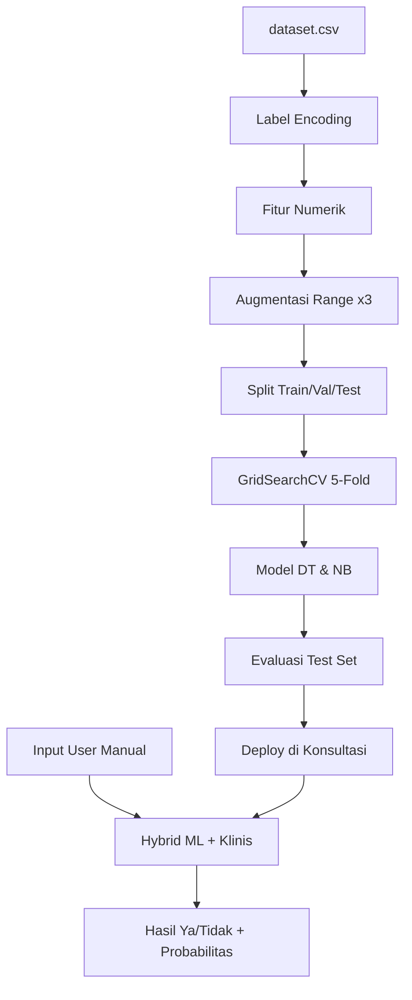

# 🫁 ParuSehat — Sistem Cerdas Diagnosis Penyakit Paru-Paru

**Aplikasi web interaktif berbasis Streamlit & Machine Learning untuk screening risiko penyakit paru-paru.**

Menggabungkan prediksi ML hybrid, skor risiko klinis, simulasi paru anatomi interaktif, dan edukasi komprehensif berhenti merokok dengan sistem tier perokok.

[](https://www.python.org/downloads/)
[](https://streamlit.io/)
[](#lisensi)

---

## 📋 Daftar Isi

1. [🚀 Quick Start](#-quick-start)
2. [✨ Fitur Utama](#-fitur-utama)
3. [📥 Instalasi & Setup](#-instalasi--setup)
4. [🏃 Cara Menjalankan](#-cara-menjalankan)
5. [📁 Struktur Proyek & Penjelasan Kode](#-struktur-proyek--penjelasan-kode)
6. [🧠 Alur Machine Learning](#-alur-machine-learning)
7. [📱 Halaman Aplikasi (Views)](#-halaman-aplikasi-views)
8. [🚭 Layanan Berhenti Merokok](#-layanan-berhenti-merokok)
9. [📊 Dataset](#-dataset)
10. [⚙️ Catatan Teknis](#-catatan-teknis)
11. [🛠️ Troubleshooting](#-troubleshooting)
12. [📝 Lisensi](#-lisensi)

---

## 🚀 Quick Start

**Prasyarat:** Python 3.8+, pip

```bash
# 1. Clone atau download project
cd sistem-cerdas

# 2. Install dependencies
pip install -r requirements.txt

# 3. Jalankan aplikasi
streamlit run app.py

# 4. Buka di browser (biasanya http://localhost:8501)
```

> ⏱️ **Catatan:** Pelatihan model pertama kali membutuhkan waktu ~15–40 detik (30.000+ data + augmentasi + GridSearch). Hasil di-cache otomatis untuk akses berikutnya.

---

## ✨ Fitur Utama

| Fitur | Keterangan |
|-------|------------|
| 🤖 **Pipeline ML lengkap** | Preprocessing → augmentasi range → GridSearchCV → 5-Fold CV → evaluasi komprehensif |
| 🎯 **Prediksi hybrid** | ML + skor risiko klinis (akurat untuk perokok berat & edge cases) |
| 📝 **Input manual range** | Umur, batang/hari, lama merokok — fleksibel, tidak terpaku kombinasi dataset |
| 🫁 **Simulasi paru interaktif** | SVG anatomi lengkap + animasi napas real-time + visualisasi kerusakan dinamis |
| 🎪 **Tierlist perokok** | C (Ringan) / B (Sedang) / S (Berat) dengan punchline & tips kesehatan |
| 🤝 **Layanan KBM & Komunitas** | Informasi klinik berhenti merokok, klan peer-support, program 4 fase |
| 📜 **Riwayat konsultasi** | Tracking per sesi dengan probabilitas, tier, dan rekomendasi |
| 📊 **Dashboard & Analitik** | Statistik dataset, metrik model, confusion matrix, kurva ROC |

---

## 📥 Instalasi & Setup

### Prasyarat Sistem
- **OS**: Windows, macOS, atau Linux
- **Python**: 3.8 atau lebih tinggi
- **Disk**: Minimal 500 MB untuk dataset & cache model
- **RAM**: Minimal 2 GB (rekomendasi 4 GB+)

### Langkah Instalasi

**1. Clone atau download project**
```bash
cd path/to/sistem-cerdas
```

**2. Buat virtual environment (optional tapi disarankan)**
```bash
python -m venv venv

# Aktifkan virtual environment
# Windows:
venv\Scripts\activate
# macOS/Linux:
source venv/bin/activate
```

**3. Install dependencies**
```bash
pip install -r requirements.txt
```

Pastikan semua package terinstall:
- ✅ streamlit >= 1.32.0
- ✅ pandas >= 2.0.0
- ✅ scikit-learn >= 1.3.0
- ✅ matplotlib >= 3.7.0
- ✅ numpy >= 1.24.0

---

## 🏃 Cara Menjalankan

**Jalankan aplikasi:**
```bash
streamlit run app.py
```

**Akses aplikasi:**
- Browser akan terbuka otomatis atau buka manual di `http://localhost:8501`
- Sidebar kiri untuk navigasi antar halaman
- Aplikasi siap untuk digunakan

**Tips:**
- ⏱️ Load pertama ~15–40 detik (model training + cache)
- 🔄 Reload berikutnya instant (hasil di-cache)
- 🛑 Untuk stop: tekan `Ctrl+C` di terminal

---

## 📁 Struktur Proyek & Penjelasan Kode

```
sistem cerdas/
├── app.py                      # Entry point Streamlit, routing menu, cache model
├── data/
│   └── dataset.csv             # 30.000+ sampel, 9 fitur + label Hasil
├── modules/                    # Logika inti (ML + bisnis)
│   ├── load_data.py            # Membaca CSV ke DataFrame
│   ├── preprocess.py           # Label Encoding per kolom + encode input user
│   ├── features.py             # Konversi ke fitur numerik + augmentasi + benchmark
│   ├── model.py                # GridSearchCV, CV, metrik, ROC, pemilihan model terbaik
│   ├── predict.py              # Prediksi hybrid (ML + klinis)
│   ├── consultation.py         # Skor risiko klinis, aturan perokok berat, BMI
│   ├── smoking_tiers.py        # Tier C/B/S, punchline, badge sidebar, tips
│   ├── quit_services.py        # Layanan KBM, klan komunitas, roadmap quit
│   ├── lung_visual.py          # Hitung kerusakan paru (formula)
│   ├── lung_component.py       # Widget HTML paru + slider Streamlit
│   ├── lung_widget_build/
│   │   └── index.html          # SVG paru, animasi napas, slider JS instan
│   └── ui.py                   # CSS global, menu, hero card, sidebar brand
└── views/                      # Halaman UI (bukan folder Streamlit pages/)
    ├── beranda.py              # Dashboard ringkasan
    ├── preprocessing.py        # Tab data mentah & encoding
    ├── ml_pipeline.py          # Dokumentasi pipeline ML
    ├── prediksi.py             # Form konsultasi + diagnosis
    ├── evaluasi_model.py       # Perbandingan DT vs NB, ROC curve
    └── history.py              # Riwayat sesi
```

### `app.py` — 🎬 Titik Masuk

- Mengatur `st.session_state.history` untuk riwayat konsultasi.
- Fungsi `prepare_models()`:
  1. Load `dataset.csv`
  2. Label encoding (`preprocess.py`)
  3. Build matriks numerik + **augmentasi 3×** (`features.py`)
  4. Train Decision Tree & Naive Bayes dengan GridSearch (`model.py`)
  5. Simpan benchmark dataset untuk tolok ukur input user
- Sidebar: brand **ParuSehat**, badge status paru (sehat / tier perokok), navigasi 6 menu.

### `modules/preprocess.py` — 🔤 Encoding Data

- **Label Encoding terpisah** per kolom kategorikal (bug lama: satu encoder untuk semua kolom).
- `FEATURE_COLUMNS`: 9 atribut (Usia, Merokok, dll.).
- `encode_input()`: ubah pilihan user (teks) → angka untuk model.

### `modules/features.py` — 🎲 Feature Engineering & Augmentasi

- Mengubah dataset kategorikal → **fitur numerik** (`umur`, `pack_years`, `batang_hari`, dll.).
- `augment_range_samples()`: tambah sampel sintetis dengan jitter agar model belajar **range kontinu**, bukan hanya kombinasi yang ada di CSV.
- `build_benchmarks()`: min, max, mean, persentil — dipakai di halaman Konsultasi untuk bandingkan input user vs populasi dataset.

### `modules/model.py` — 🤖 Training & GridSearch

- Split: **Train 64% / Val 16% / Test 20%** (stratified).
- **GridSearchCV** dengan scoring **F1-Score**:
  - Decision Tree: `max_depth`, `min_samples_split`, `criterion`, dll.
  - Naive Bayes: `var_smoothing`
- **5-Fold Stratified Cross-Validation** pada data latih.
- Metrik test: Accuracy, Precision, Recall, F1, ROC-AUC, confusion matrix, kurva ROC.
- Model terbaik dipilih otomatis (F1 tertinggi di test set).

### `modules/predict.py` — 🎯 Prediksi Hybrid

```
Input user → Fitur numerik → Model ML → Hasil ML (Ya/Tidak)
                    ↓
              Skor risiko klinis (0–100)
                    ↓
         Aturan keras (perokok berat → wajib Ya)
                    ↓
              Hasil final + probabilitas
```

**Aturan keras contoh:** ≥6 batang/hari & ≥5 tahun → risiko **Ya** otomatis.

### `modules/consultation.py` — 📋 Scoring Klinis

- `umur_ke_kategori()`: umur angka → Muda (≤44) / Tua (≥45).
- `hitung_skor_risiko_klinis()`: pack-years, batang, umur, BMI, keluhan.
- `gabungkan_prediksi()`: menggabungkan ML + klinis.

### `modules/smoking_tiers.py` — 🎪 Tier & Punchline

| Tier | Kriteria | Status |
|------|----------|--------|
| **C** | Ringan | *langkah 76 apel* 🍎 |
| **B** | Sedang | *napas surya* ☀️ |
| **S** | Berat | *rokoknya pasti ilegal* 🚫 |

- Badge sidebar, tierlist visual, tips berhenti merokok per tier.

### `modules/lung_component.py` + `lung_widget_build/index.html` — 🫁 Visualisasi Paru Interaktif

- Widget **HTML + JavaScript** (bukan custom component Streamlit — lebih stabil).
- Slider di dalam HTML → paru berubah **instan** (`oninput`).
- Slider Streamlit di bawah → nilai resmi untuk diagnosis.
- Animasi: napas normal / terbatas / sesak (CSS keyframes).
- Bentuk paru: trakea, carina, lobus, takik jantung, fissure, diafragma.

### `modules/quit_services.py`

- Data layanan: Klan komunitas, KBM, Quitline, program digital.
- Roadmap quit 4 fase.
- Ditampilkan di `views/prediksi.py` via `show_quit_tips_and_layanan()`.

---

## 🧠 Alur Machine Learning



| Tahap | File | Metode |
|-------|------|--------|
| Preprocessing | `preprocess.py` | LabelEncoder per kolom |
| Feature engineering | `features.py` | Umur, pack-years, flags biner |
| Augmentasi | `features.py` | Jitter umur/rokok dalam range |
| Tuning | `model.py` | GridSearchCV, F1 |
| Validasi | `model.py` | StratifiedKFold k=5 |
| Prediksi | `predict.py` | `predict_proba` + koreksi klinis |

---

## 📱 Halaman Aplikasi (Views)

| Menu | File | Fungsi |
|------|------|--------|
| 🏠 Beranda | `beranda.py` | Statistik dataset, ringkasan model, diagram pipeline |
| 📊 Dataset & Preprocessing | `preprocessing.py` | Preview data mentah, hasil encoding, tabel mapping |
| 🔬 Pipeline ML | `ml_pipeline.py` | Split data, GridSearch, CV, jumlah sampel |
| 🏥 **Konsultasi** | `prediksi.py` | Form lengkap, paru interaktif, diagnosis, punchline |
| 📈 Evaluasi Model | `evaluasi_model.py` | Tabel metrik, confusion matrix, ROC |
| 📜 Riwayat | `history.py` | Daftar konsultasi sesi ini |

> 📌 Folder `views/` sengaja **bukan** `pages/` Streamlit agar tidak bentrok dengan multipage otomatis.

---

## 🚭 Layanan Berhenti Merokok

### 📌 Gaya Penulisan Peringatan Kesehatan

> Gaya penulasan mengikuti **bungkus rokok**: kotak peringatan, huruf tegas, pesan singkat dan lugas.

```
╔══════════════════════════════════════════════════════════════════╗
║  P E R I N G A T A N   K E S E H A T A N                         ║
║                                                                  ║
║  BERHENTI MEROKOK SEKARANG JUGA                                ║
║  DAPAT MENURUNKAN RISIKO PENYAKIT PARU-PARU                      ║
╚══════════════════════════════════════════════════════════════════╝

┌──────────────────────────────────────────────────────────────────┐
│  MEROKOK DAPAT MENYEBABKAN KANKER PARU-PARU                      │
│  DAN PENYAKIT JANTUNG CORONER                                    │
│                                                                  │
│  HUBUNGI KLINIK BERHENTI MEROKOK (KBM) TERDEKAT                  │
└──────────────────────────────────────────────────────────────────┘

┌──────────────────────────────────────────────────────────────────┐
│  PEROKOKAN IBU HAMIL DAPAT MENYEBABKAN BAYI LAHIR PREMATUR       │
│  DAN KEMATIAN BAYI                                                 │
└──────────────────────────────────────────────────────────────────┘

╔══════════════════════════════════════════════════════════════════╗
║  ANDA TIDAK SENDIRIAN — BERGABUNGLAH DENGAN                      ║
║  KLAN / KOMUNITAS BERHENTI MEROKOK                               ║
╚══════════════════════════════════════════════════════════════════╝
```

### 📋 Isi Layanan di Aplikasi

> Gaya penulasan mengikuti **bungkus rokok**: kotak peringatan, huruf tegas, pesan singkat dan lugas.

```
╔══════════════════════════════════════════════════════════════════╗
║  P E R I N G A T A N   K E S E H A T A N                         ║
║                                                                  ║
║  BERHENTI MEROKOK SEKARANG JUGA                                ║
║  DAPAT MENURUNKAN RISIKO PENYAKIT PARU-PARU                      ║
╚══════════════════════════════════════════════════════════════════╝

┌──────────────────────────────────────────────────────────────────┐
│  MEROKOK DAPAT MENYEBABKAN KANKER PARU-PARU                      │
│  DAN PENYAKIT JANTUNG CORONER                                    │
│                                                                  │
│  HUBUNGI KLINIK BERHENTI MEROKOK (KBM) TERDEKAT                  │
└──────────────────────────────────────────────────────────────────┘

┌──────────────────────────────────────────────────────────────────┐
│  PEROKOKAN IBU HAMIL DAPAT MENYEBABKAN BAYI LAHIR PREMATUR       │
│  DAN KEMATIAN BAYI                                                 │
└──────────────────────────────────────────────────────────────────┘

╔══════════════════════════════════════════════════════════════════╗
║  ANDA TIDAK SENDIRIAN — BERGABUNGLAH DENGAN                      ║
║  KLAN / KOMUNITAS BERHENTI MEROKOK                               ║
╚══════════════════════════════════════════════════════════════════╝
```

### Isi layanan di aplikasi (`modules/quit_services.py`)

| Layanan | Penjelasan |
|---------|------------|
| **Klan / Komunitas** | Kelompok peer-support: meet mingguan, grup chat, buddy system — seperti “klan” yang saling jaga napas sehat |
| **Klinik KBM** | Konseling di Puskesmas/RS, terapi nikotin, rencana quit bertahap, follow-up |
| **Quitline** | Hotline konsultasi anonim |
| **Program digital** | App tracking hari tanpa rokok |

**Roadmap program (umum):**

- 📅 Minggu 1–2: fase detoks, hindari pemicu  
- 📅 Minggu 3–4: keinginan menurun, olahraga ringan  
- 📅 Bulan 2–3: paru mulai pulih, tetap di komunitas  
- 📅 Bulan 6+: maintenance, jangan lengah  

> 💡 **Di aplikasi**: buka **Konsultasi** → isi riwayat merokok → expander **Layanan Berhenti Merokok & Klan Komunitas (KBM)**.

### 📚 File Konfigurasi Layanan

Edit `modules/quit_services.py` untuk menambah/mengubah:
- `LAYANAN_UTAMA` — Daftar layanan yang tersedia
- `PROGRAM_TAHAP` — Tahap-tahap program berhenti merokok

---

## 📊 Dataset

| Kolom | Nilai contoh | Keterangan |
|-------|--------------|------------|
| 📅 Usia | Muda, Tua | Dikonversi dari umur angka user |
| 👤 Jenis_Kelamin | Pria, Wanita | |
| 🚬 Merokok | Aktif, Pasif | + input batang/tahun untuk skor klinis |
| 💼 Bekerja | Ya, Tidak | |
| 🏠 Rumah_Tangga | Ya, Tidak | |
| 🌙 Aktivitas_Begadang | Ya, Tidak | |
| 🏃 Aktivitas_Olahraga | Sering, Jarang | |
| 🏥 Asuransi | Ada, Tidak | |
| 🦠 Penyakit_Bawaan | Ada, Tidak | |
| **🎯 Hasil** | **Ya**, **Tidak** | Label target (risiko penyakit paru-paru) |

**Informasi dataset:**
- 📦 **~30.000 baris** di `data/dataset.csv`
- 🔤 Label encoding untuk pelatihan
- 📊 Input konsultasi memakai **fitur numerik + range**

---

## ⚙️ Catatan Teknis

### 🤔 Mengapa Prediksi Hybrid?

Dataset memiliki kekhususan: label `Merokok=Aktif` vs `Pasif` tidak selalu selaras dengan logika medis umum.  
Sistem menambah **skor klinis** dan **aturan perokok berat** agar hasil mendekati pemeriksaan ke ahli paru.

### 💾 Session State Penting

| Key | Fungsi |
|-----|--------|
| `history` | Riwayat konsultasi |
| `lung_batang_slider` / `lung_lama_slider` | Nilai rokok untuk ML |
| `is_smoker` / `smoking_tier` | Badge sidebar |

### ✏️ Menambah Punchline / Tier

Edit `modules/smoking_tiers.py` → `TIERS`, `PUNCHLINE` di `views/prediksi.py`.

### ➕ Menambah Layanan KBM

Edit `LAYANAN_UTAMA` dan `PROGRAM_TAHAP` di `modules/quit_services.py`.

---

## 🛠️ Troubleshooting

### ❌ Error: "ModuleNotFoundError: No module named 'streamlit'"
```bash
# Pastikan virtual environment aktif, kemudian install kembali:
pip install -r requirements.txt
```

### ❌ Error: "FileNotFoundError: data/dataset.csv"
```bash
# Pastikan Anda berada di folder project root:
cd path/to/sistem-cerdas
streamlit run app.py
```

### ⏳ Aplikasi load sangat lama (>60 detik)
- Ini normal pada **kali pertama** (training model + augmentasi)
- Gunakan tombol **"Rerun"** di Streamlit untuk me-refresh cache
- Selanjutnya akan instant (cache di-simpan)

### 🔄 Model tidak update setelah edit code
```python
# Di app.py, hapus cache lama:
# Python: del st.session_state["model_cache"]
# Atau restart terminal dan jalankan ulang: streamlit run app.py
```

### 🐛 Paru widget tidak bergerak / interaktif
- Periksa apakah file `modules/lung_widget_build/index.html` ada
- Browser compatibility: gunakan Chrome/Edge/Firefox modern
- Buka Developer Console (F12) untuk lihat error JavaScript

### 📊 Prediksi terasa tidak akurat
- Cek `modules/consultation.py` untuk aturan hybrid
- Lihat `modules/smoking_tiers.py` untuk threshold tier
- Review `modules/model.py` metrics di halaman Evaluasi Model

---

## 📝 Lisensi

Proyek **ParuSehat** — Sistem Cerdas Diagnosis Penyakit Paru-Paru  
**Tujuan**: Edukasi kesehatan & screening risiko paru-paru (bukan diagnosis medis)

**Disclaimer**:
> ⚠️ Aplikasi ini adalah **alat screening/edukasi** dan BUKAN pengganti konsultasi medis profesional.  
> Hasil prediksi hanya untuk referensi. **Selalu konsultasi dengan dokter spesialis paru** untuk diagnosis resmi.

**License**: MIT (lihat LICENSE.md jika ada)

---

## 👥 Pengembang & Kontribusi

Proyek tugas **Sistem Cerdas** — ParuSehat v2.0  
**Stack**: Machine Learning (scikit-learn) + Streamlit + Python

### 🤝 Cara Berkontribusi

1. Fork repository
2. Buat branch feature (`git checkout -b feature/improvement`)
3. Commit changes (`git commit -m "Deskripsi perubahan"`)
4. Push to branch (`git push origin feature/improvement`)
5. Buat Pull Request

### 📧 Pertanyaan & Saran

- **Issues**: Buat issue di GitHub untuk bug reports
- **Discussions**: Untuk saran fitur & diskusi umum
- **Documentation**: Perbarui README jika ada perubahan besar

---

## 📚 Referensi

- [Streamlit Documentation](https://docs.streamlit.io/)
- [Scikit-learn GridSearchCV](https://scikit-learn.org/stable/modules/generated/sklearn.model_selection.GridSearchCV.html)
- [Merokok & Kesehatan Paru](https://www.who.int/news-room/fact-sheets/detail/smoking)

---

**Last Updated**: May 27, 2026  
**Version**: 2.0
